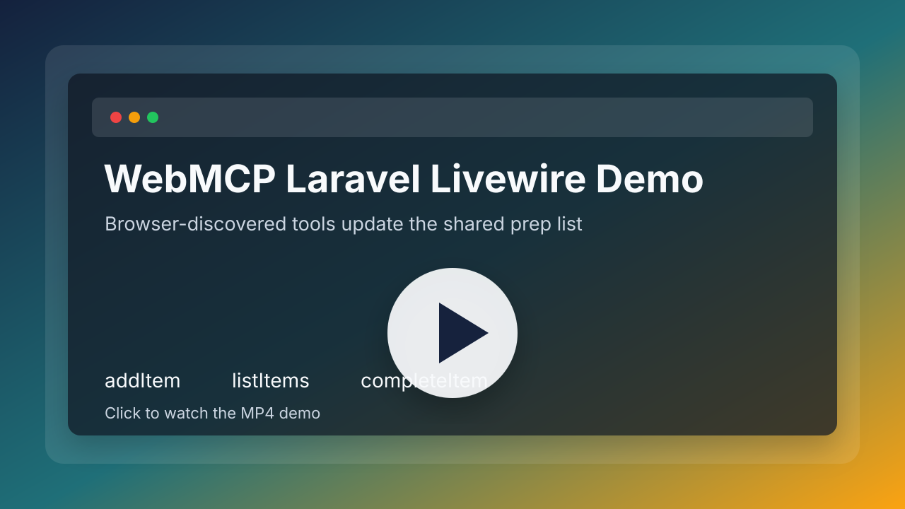

# WebMCP Laravel Livewire Demo

A minimal Laravel + Livewire application that exposes Livewire component methods as WebMCP tools.

The demo page is a shared preparation list. Humans can add, complete, and remove items through the UI. AI agents can do the same through WebMCP tools registered by the page. Both paths use the same Livewire component methods and update the same file-cache-backed list, so no database is required.

## What This Shows

- Registering page-defined WebMCP tools from a Livewire component.
- Calling PHP component methods through WebMCP without creating custom API endpoints.
- Sharing state between human browser users and AI agents with Laravel's file cache.
- Keeping connected tabs updated with simple Livewire polling instead of WebSockets.
- Running the app through an HTTPS tunnel such as ngrok so WebMCP can be tested in a secure context.

## Demo Flow

[](https://github.com/kefyusuf/webmcp-laravel-demo/releases/download/demo-video-2026-09-03/demo-video-2026-09-03.mp4)

Open `/prep-list` in a browser that supports WebMCP. The page registers these tools:

- `addItem` - add an item with an optional note.
- `completeItem` - mark an item as completed by name.
- `removeItem` - remove an item by name.
- `addNoteToItem` - add or update an item note.
- `listItems` - return the current list with status, notes, and author names.

Human users receive temporary names such as `Guest 4821`. Agent actions receive temporary names such as `Agent 2117`. The names are session-based, while the list and activity log are shared through Laravel's `file` cache store.

## Requirements

- PHP 8.3+
- Composer
- Node.js and npm
- A browser or agent environment that exposes WebMCP as `document.modelContext`

## Installation

Keep the package and the demo app as sibling directories during local development:

```text
projects/
├── webmcp-laravel/
└── webmcp-laravel-demo/
```

```bash
git clone https://github.com/kefyusuf/webmcp-laravel.git
git clone https://github.com/kefyusuf/webmcp-laravel-demo.git
cd webmcp-laravel-demo
```

This demo loads the package from `../webmcp-laravel` through Composer's path repository support. After cloning both repositories, install the demo app:

```bash
composer install
npm install
cp .env.example .env
php artisan key:generate
npm run build
php artisan vendor:publish --tag=webmcp-assets --force
```

The demo does not need a database for the shared list. It stores demo state in Laravel's file cache under `storage/framework/cache`.

On Windows, Laragon is a convenient place to keep these folders, for example under `C:\laragon\www`, but it is not required. Any local development directory works as long as the package and demo repositories remain siblings.

## Running Locally

```bash
php artisan serve --host=127.0.0.1 --port=8000
```

Then open:

```text
http://127.0.0.1:8000/prep-list
```

Local HTTP is useful for normal UI checks, but WebMCP discovery may require HTTPS because the browser API is secure-context-only.

## Testing With Ngrok

Start the Laravel development server first:

```bash
php artisan serve --host=127.0.0.1 --port=8000
```

In another terminal, expose the same port:

```bash
ngrok http 8000
```

Open the HTTPS forwarding URL that ngrok prints, then visit `/prep-list`.

Example:

```text
https://your-random-subdomain.ngrok-free.app/prep-list
```

Free ngrok tunnels may show an interstitial warning the first time a browser visits the URL. Click "Visit Site" to continue. Agent/browser automation can also avoid the interstitial by sending the `ngrok-skip-browser-warning` request header, but a normal browser visit only needs the one-time confirmation.

If the page loads over HTTPS but Livewire asset or update URLs are generated as HTTP, WebMCP calls can fail because the browser blocks mixed content. This demo configures Laravel's trusted proxy headers in `bootstrap/app.php` so ngrok's forwarded HTTPS scheme is respected.

## Agent Prompt

Use a prompt like this when recording or testing the demo:

```text
Visit this page:

https://your-ngrok-url.ngrok-free.app/prep-list

Before opening the page, select your own integrated/in-app browser for this demo, so the page can expose WebMCP through that browser context. Do not switch to an external browser such as Chrome unless I explicitly ask you to.

First, list the WebMCP tools available on the page. For each tool, tell me its name and what it does.

Then perform these actions step by step. After each step, report which tool you called and the result returned by the tool.

1. Add an item named "passport" to the list, with the note "required for border crossing".
2. Add another item named "charger" to the list. No note is needed.
3. Summarize the current full state of the list: which items exist, which ones are completed, and who added each item.
4. Mark the "passport" item as completed.
5. Summarize the list again and confirm that the change was applied.
```

## How It Works

The Livewire component uses the `HasWebMcpTools` trait and marks selected public methods with `#[WebMcpTool]`.

The Blade view emits the generated tool schema:

```blade
@webmcpTools($this)
```

The layout loads the bridge:

```blade
@webmcpBridge
```

The bridge reads the schema and registers tools with:

```js
const modelContext = document.modelContext || navigator.modelContext || null;
modelContext.registerTool({ ... });
```

When an agent calls a tool, the bridge calls the matching Livewire method through `Livewire.find(componentId).call(...)`.

## Real-Time Strategy

This demo intentionally avoids Laravel Reverb, broadcasting, Redis, and database tables.

Instead:

- Shared list state lives in Laravel's file cache.
- User and agent display names live in the browser session.
- The component uses `wire:poll.2s` so connected users see updates within a few seconds.

This is enough for a small demo. For production, replace the file cache with a durable store and consider Laravel Reverb or another broadcasting driver when low-latency updates matter.

## Tests

```bash
php artisan test tests/Feature/PrepListTest.php
```

The feature test verifies that agent and human actions share the same file-cache-backed list and that the page includes the polling markers needed for connected tabs.

## Laravel Boost

This repository includes Laravel Boost development guidance and MCP configuration. The generated `AGENTS.md` file documents the Laravel, Livewire, testing, and formatting conventions used by coding agents working on this project.

## Package

The reusable package should live in its own repository, for example `webmcp-laravel`. During local demo development, this app loads it as a sibling path repository:

```json
{
  "type": "path",
  "url": "../webmcp-laravel"
}
```

After the package is published on Packagist, the demo can switch to a normal package constraint such as:

```bash
composer require webmcp/laravel
```

## License

MIT
